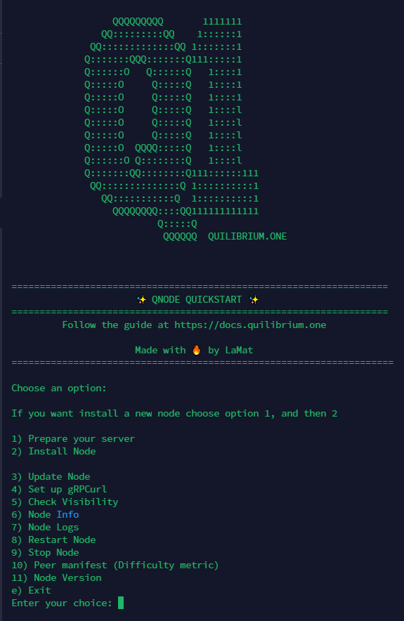

# 😎 Node Quickstart

This is a little tool that you can run in your terminal, and it will give you a menu with the main options to install/update your node, as well as some useful shortcodes.

In my opinion, it is better to follow the [node-auto-installer.md](node-auto-installer.md "mention") guide if this is your first installation, but this tool may come in handy for managing your node later.

Simply run the below code in your terminal.


Follow the [safety-checks.md](safety-checks.md "mention") before running this script in your server



```bash
wget -O qone.sh https://github.com/lamat1111/QuilibriumScripts/raw/main/qone.sh && chmod +x qone.sh && ./qone.sh
```


After the first run, to run again the QNode Quickstart just run

```bash
./qone.sh
```

<figure><figcaption></figcaption></figure>

<table data-card-size="large" data-column-title-hidden data-view="cards" data-full-width="false"><thead><tr><th></th><th></th><th data-hidden data-card-target data-type="content-ref"></th><th data-hidden></th><th data-hidden data-card-cover data-type="files"></th></tr></thead><tbody><tr><td><strong>The Best Server Providers for your Nodes</strong></td><td>CLICK TO SEE THEM</td><td><a href="best-server-providers.md">best-server-providers.md</a></td><td></td><td><a href=".gitbook/assets/Quilibrium banner 11.jpg">Quilibrium banner 11.jpg</a></td></tr><tr><td><strong>Palau Digital ID - KYC for Web 3.0</strong></td><td>CLICK TO LEARN MORE</td><td><a href="https://iri.quest/palauid">https://iri.quest/palauid</a></td><td></td><td><a href=".gitbook/assets/digital id.jpg">digital id.jpg</a></td></tr></tbody></table>
