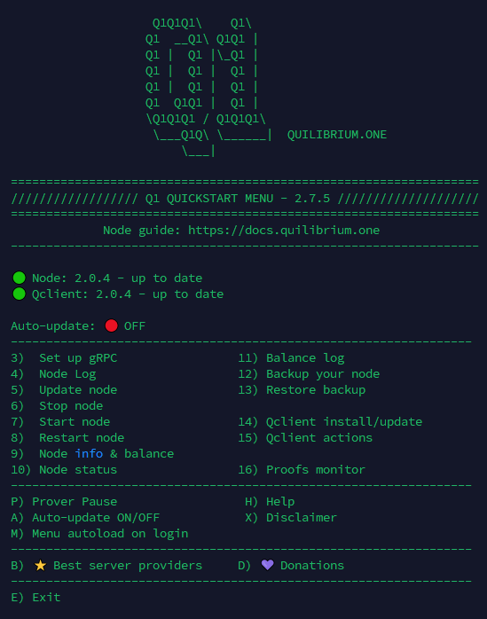

# 😎 Q1 - Node Manager


This guide and all the linked scripts have not been reviewed for compatibility with Quilibrium 2.1.x (only reviewed up to 2.0.x). Use at your own risk!



Join the Q1 Telegram channel: [https://t.me/quilibriumone](https://t.me/quilibriumone), for important updates on all Q1 scripts.


<figure><figcaption></figcaption></figure>

This is a tool that you can run in your terminal, and it will show a menu with the main options to install/update your node, as well as some useful shortcodes.

In my opinion, it is better to follow the [node-auto-installer.md](node-auto-installer.md "mention") guide if this is your first installation, but this tool may come in handy for managing your node later.

Simply run the below code in your terminal.


Follow the [safety-checks.md](safety-checks.md "mention") before running this script in your server



```bash
wget -O ~/qone.sh https://github.com/lamat1111/QuilibriumScripts/raw/main/qone.sh && chmod +x ~/qone.sh && ./qone.sh
```


After the first run, to run again the Q1 menu just run `./qone.sh`, it should also work by just typing `q1`  or `qone`.

***

**Old Q1 menu versions will automatically load every time you log in.**

If this is annoying to you, simply run the below command and the menu will not load by default anymore.

```bash
sed -i 's|^~/qone.sh|#&|' ~/.bashrc && source ~/.bashrc
```

***
