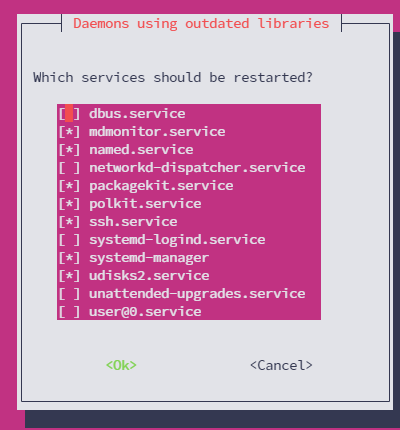

# 🩷 Escaping the "Pink Screen of Death"

Sometimes when updating the apps with the [node-auto-installer.md](../node-auto-installer.md "mention"), or even manually, you will receive what I call the "Pink Screen of Death".

This is just a screen that ask you which services you want to restart, and usually clicking ENTER should suffice to move on. The issue is… sometimes it doesn't work, and you get stuck here.

<figure><figcaption>
The Pink Screen of Death
</figcaption></figure>

**To solve this issue, you may try these steps:**

1. Log in to your server via another terminal window and reboot: `sudo reboot`
2. Run again the app update manually: `sudo apt -q update`
3. Install some extra apps: `sudo apt-get install git wget tmux tar -y`
4. If everything went smoothly up to here, you can either run again the [node-auto-installer.md](../node-auto-installer.md "mention")script (step 3), or you can proceed with the [node-step-by-step-installation.md](node-step-by-step-installation.md "mention")where you left off.

_This process almost always solved the issue for me, I really hope you don't get stuck in the pink forever ;-)_
